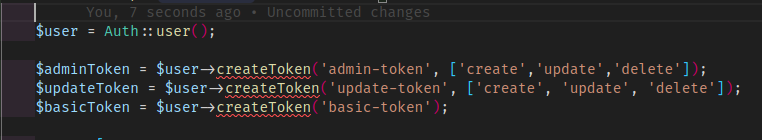

# Laravel-Scantum

tulisan ini hanya berisikan kesalahan-kesalahn saya saat mebuild beberapa backend beriku kesalahanya dan solvenya:

* saat melakuan generate token pada aplikasi backend guna bisa mendapatkan hak ases data yang di tuju, tapi saat melakan terdapat kendala pada gamabr di bawah ini:

  yang mana menimbulkan tanda merah pada code diatas dan mendapatkan pesan seperti ini : `Undefined method 'createToken'.`
* penyebanya karna saat kita inisialisasi variable `$user` maka yang dianggap adalah variable yang sama pada package Auth yang di package scantum, padahal yang di inginkan adalah variable `$user` yang ada pada model `App\Models\Users` maka dari itu kita kasih blok variabel seperti yang dibawah ini:
  `/**  @var \App\Models\User $user */`

  ```php
  if (Auth::attempt($credential)) {
              /**  @var \App\Models\User $user */
              $user = Auth::user();

              $adminToken = $user->createToken('admin-token', ['create','update','delete']);
              $updateToken = $user->createToken('update-token', ['create', 'update', 'delete']);
              $basicToken = $user->createToken('basic-token');

              return [
                  'admin'=>$adminToken->plainTextToken,
                  'update'=>$updateToken->plainTextToken,
              'basic'=>$basicToken->plainTextToken
              ];
          }
  ```

###### cara costume auth dengan table selain table users.

* pastikan table selain user sudah memeiliki inheriten class berikut
  ex:
  disini saya menggunaka kasus table employee yang sudah implmentasi dari model seperti dibawah ini:

  ```php
  // semula
  class Employes extends Model
  menjadi:
  use Illuminate\Foundation\Auth\User as Authenticatable;
  use Laravel\Sanctum\Contracts\HasApiTokens as HasApiTokensContract;
  class Employes extends Authenticatable implements HasApiTokensContract
  ```
  setelah merubah table menjadi table yang bisa di defenisikan menjadi table auth,sekarang kita menambhakan beberpa trait
* pastikan sudah terpasang trait HasApiTokens berikut.

  ```php
  use Laravel\Sanctum\HasApiTokens;
  use Illuminate\Notifications\Notifiable;
  use Illuminate\Database\Eloquent\Factories\HasFactory;
  class Employes extends Authenticatable implements HasApiTokensContract
  {
      use HasFactory;
      use HasApiTokens;
      use Notifiable;

  }
  ```
  trait HasApiTokens berfungsi untuk melakukan generation token yang di kelola oleh sanctum.
* pastikan sudah membuat settingan providers di config/auth.php seperti :

  ```php
  'providers' => [
          'users' => [
              'driver' => 'eloquent',
              'model' => App\Models\User::class,
          ],
          'employees'=>[
              'driver' => 'eloquent',
              'model' => App\Models\Employes::class,
          ],
          'costumers'=>[
              'driver' => 'eloquent',
              'model' => App\Models\Costumers::class,
          ]

          // 'users' => [
          //     'driver' => 'database',
          //     'table' => 'users',
          // ],
      ],
  ```
  porviders, berfungsi untuk reosurce mana yang akan dijadikan sebagai authentikasinya. dimana terdiri dari driver sebagai type yang digunakan,model sebagai representasi dari table.
* pastikan sudah membuat guard di config/auth.php seperti :

  ```php
  'guards' => [
          'web' => [
              'driver' => 'session',
              'provider' => 'users',
          ],
          'api_employe'=>[
              'driver' => 'session',
              'provider' => 'employees',
          ],
          'api_costumers'=>[
              'driver' => 'session',
              'provider' => 'costumers',
          ]
      ],
  ```
  guard, berfungsi sebagai batasan atau spesifk data yang mana yang akan menjadi general auth yang terdiri  dari driven sebagai type nya dan provider sebagai resource yang akan di gunakan.
* lalu cara penggunaanya seperti di bawah ini :

  ```php
  public function logiKaryawan (Request $request)
      {
          if(Auth::guard('api_employe')->attempt(['email'=>$request->email,'password'=>$request->password]))
          {
              /** @var \App\Models\Employes $user  */
              $user = Auth::guard('api_employe')->user();
              DB::beginTransaction();
              try {
                  //code...
                  $employee =Employes::findOrFail($user->id);
                  $employee->remember_token =$user->createToken('auth_employee')->plainTextToken;
                  $employee->save();
                  $resourceEmployee =new AuthEmployeeResource($employee);
                  DB::commit();
              } catch (\Exception $th) {
  		Log::error('somthing worng in log in as employee'. $th);
              }
  	    Log::info('user as employee has logged : '.$resourceEmployee);
              return response()->json(["message"=>'berhasil','data'=>$resourceEmployee],Response::HTTP_ACCEPTED);

          }else {
              return response()->json(['message'=>'tidak berhasil masuk'],Response::HTTP_FAILED_DEPENDENCY);
          }
      }
  ```
  pada controller AuthController.php terdapat method loginkaryawan() yang berfungsi untik melakukan authentikasi untuk memanggil config auth yang udah di setiing dengan cara  `Auth::guard('api_employe')` dengan begitu auth akan otomasti mengarah ke auth yang di tuju.
