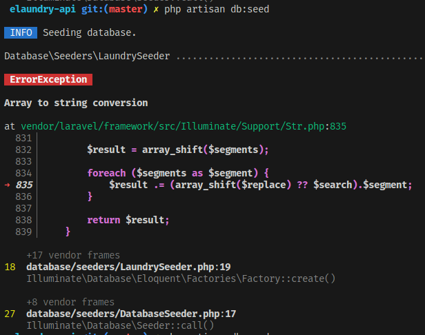

# laravel study case

ini adalaha beberapa kumpulan study case berdasarkan malasah yang sering saya hadapi saat membangun aplikasi,sub judul adalaha perwakilan pesan error yang sedang terjadi dan bagan tiap sub judul adalah stroy case,step solve in case,

###### Array to string conversion run db seed

jika mendapatak error seperti di bawah ini:



biasanya terjadi pada file factory yang sedang di kompail belum memenuhi persayaratan,dan harus diperhatikan tiap retrun dari build function yang ingin kita pakai,contoh kasus code seperti dibahwa ini:

`file LaundryFactory.php`

```php
public function definition()
    {
        $table = new Costumers();
        return [
            'costumer_id' => Costumers::factory(),
            'weight_first' => 1.00,
            'weight_second' => 300,
            'photo' =>$this->faker->imageUrl(500, 600, 'dirty clothes'),
            'status' => $this->faker->randomElement(['p','f','pu','tw',]),
            'price_first' => 8000,
            'price_second' =>80.000,
            'trigger'=>$this->faker->boolean(),
            'location_deafult' => [ $this->faker->latitude(),$this->faker->longitude() ],
            'location_now' => json_encode([$this->faker->latitude(),$this->faker->longitude()])
        ];
    }
```

pada code di atas terjadi kesalahan ekpsetasi dari filed table yang dimana hasil yang harus di kembalikan berupa json,pada line 13, tapi sebelum mengetahui apakah itu terjadi diline 13 maka kita harus mengetahui dulu expect type data yang di terima oleh table tersebut berikut step solve-nya.

* jika anda menggunakan build migrate, pastikan chek type data tiap field yang di tampung.
* pastikan type data yang di kembalikan saat menggunakan builder function faker.

dengan begitu permasalahan yang bisa diekatuhi solvnya.

###### menangkap error dengan log.

Untuk mencatat log kesalahan yang terkait dengan masalah CORS di Laravel, Anda dapat menggunakan fungsi `Log::error()` untuk mencatat pesan kesalahan ke file log aplikasi Laravel. Anda dapat menambahkan baris kode berikut di dalam blok `catch` pada bagian kode yang menangani permintaan Anda:

```php
catch (\Throwable $th) {
    DB::rollBack();
    Log::error('Error saat memproses permintaan: ' . $th->getMessage());
    return response()->json(["message" => $th->getMessage()]);
}
```

Dengan cara ini, ketika terjadi kesalahan dalam memproses permintaan, pesan kesalahan akan dicatat ke file log aplikasi Laravel, dan Anda dapat melihatnya di file log yang sesuai. Biasanya, log kesalahan akan disimpan di file `storage/logs/laravel.log` atau sesuai dengan konfigurasi log Anda.

Dengan mencatat log kesalahan seperti ini, Anda dapat memeriksa log aplikasi Laravel untuk melacak apakah ada masalah CORS yang menyebabkan kesalahan di sisi server saat permintaan dilakukan dari admin.e-laundry.site. Jika ada masalah CORS, Anda akan melihat pesan kesalahan terkait dalam log, dan dari situ Anda dapat mencari solusi untuk mengatasi masalah tersebut.

###### menggunakan index looping dari foreach untuk pengurutan nomor.

```php
@forelse ($costumer as $item)
                <tr>
                    <td>{{$loop->index +1}}</td>
                    <td>{{$item['name']}}</td>
                    <td>{{$item['email']}}</td>
                    <td>{{$item['address']}}</td>
                    <td>{{$item['address']}}</td>
                    <td>{{$item['age']}}</td>
                    <td>{{$item['location']}}</td>
                    <td><button class="btn btn-edit btn-success p-2">Edit</button></td>
                </tr>
            @empty
                <tr>belum adad</tr>
            @endforelse
```

pada tempalte foreac pada blade ada fitur yang namanya $loop dimana kita bisa manggil didalamnya index array hasil pecahan dari perulangan

###### perbedaan response->ok dan response->success

Dalam package `Illuminate\Support\Facades\Http` pada Laravel, terdapat dua metode yang dapat digunakan untuk memeriksa status response dari sebuah HTTP request, yaitu `$response->ok()` dan `$response->successful()`. Meskipun keduanya terdengar serupa, ada perbedaan penting antara keduanya:

1. `$response->ok()`: Metode ini digunakan untuk memeriksa apakah status code response adalah 200 OK. Status code 200 menunjukkan bahwa permintaan HTTP berhasil dan mendapatkan tanggapan yang valid dari server. Jadi, jika Anda ingin memeriksa apakah permintaan Anda berhasil dan mendapatkan respons yang valid, Anda dapat menggunakan metode ini.

Contoh penggunaan:

```php
$response = Http::get('https://api.example.com/data');
if ($response->ok()) {
    // Proses data response
} else {
    // Tangani jika permintaan gagal atau respons tidak valid
}
```

2. `$response->successful()`: Metode ini lebih luas daripada `$response->ok()`. Ini memeriksa apakah status code response berada dalam kisaran 200-299, yang mengindikasikan bahwa permintaan HTTP berhasil dan respons valid. Dengan kata lain, metode ini akan mengembalikan `true` jika status code adalah 2xx (sukses).

Contoh penggunaan:

```php
$response = Http::get('https://api.example.com/data');
if ($response->successful()) {
    // Proses data response
} else {
    // Tangani jika permintaan gagal atau respons tidak valid
}
```

Dalam praktiknya, jika Anda hanya ingin memeriksa apakah permintaan berhasil dan respons valid dengan status code 200 OK, Anda bisa menggunakan `$response->ok()`. Namun, jika Anda ingin memeriksa kesuksesan umum dari permintaan (status code dalam kisaran 2xx), Anda bisa menggunakan `$response->successful()`.

###### apakah harus menggunakan code block try-catch?

Ya, sangat disarankan untuk menggunakan blok `try-catch` saat melakukan permintaan HTTP menggunakan package `Illuminate\Support\Facades\Http` atau library HTTP lainnya. Menggunakan `try-catch` akan membantu Anda menangani kemungkinan error atau masalah yang dapat terjadi saat melakukan permintaan HTTP, seperti masalah koneksi, respons tidak berhasil, atau error lainnya.

Berikut adalah contoh penggunaan `try-catch` dalam kasus Anda:

```php
use Illuminate\Support\Facades\Http;

try {
    $response = Http::withHeaders([
        'Accept' => 'application/json'
    ])->get('sekolahskillapi.test/api/kelas');

    if ($response->successful()) {
        $data = $response->json();
        // Lakukan manipulasi data selanjutnya
    } else {
        // Tangani respons tidak berhasil
        $statusCode = $response->status();
        // Lakukan sesuatu sesuai kebutuhan, misalnya tampilkan pesan error
    }
} catch (\Exception $e) {
    // Tangani error lainnya, seperti masalah koneksi atau exception lainnya
    // Anda dapat menampilkan pesan error atau melakukan tindakan sesuai kebutuhan
    $errorMessage = $e->getMessage();
}
```

Dengan menggunakan `try-catch`, Anda dapat dengan lebih baik menangani masalah yang mungkin terjadi selama permintaan HTTP dan memberikan tanggapan yang lebih baik kepada pengguna atau mengambil tindakan yang sesuai dalam situasi yang tidak diharapkan.
