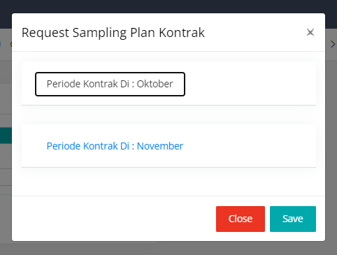
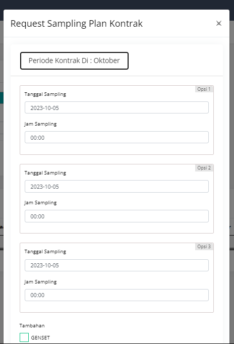

# javascript

##### tanggal

```javascript
function formatDate(dt){
        if(dt == null){
            var date = new Date();
        }else {
            var date = new Date(dt);
        }
        // var date = new Date();
        var tahun = date.getFullYear();
        var bulan = date.getMonth();
        var tanggal = date.getDate();
        var hari = date.getDay();

        switch(hari) {
            case 0: hari = "Minggu"; break;
            case 1: hari = "Senin"; break;
            case 2: hari = "Selasa"; break;
            case 3: hari = "Rabu"; break;
            case 4: hari = "Kamis"; break;
            case 5: hari = "Jum'at"; break;
            case 6: hari = "Sabtu"; break;
        }
        switch(bulan) {
            case 0: bulan = "Januari"; break;
            case 1: bulan = "Februari"; break;
            case 2: bulan = "Maret"; break;
            case 3: bulan = "April"; break;
            case 4: bulan = "Mei"; break;
            case 5: bulan = "Juni"; break;
            case 6: bulan = "Juli"; break;
            case 7: bulan = "Agustus"; break;
            case 8: bulan = "September"; break;
            case 9: bulan = "Oktober"; break;
            case 10: bulan = "November"; break;
            case 11: bulan = "Desember"; break;
        }
        var tampilTanggal = tanggal + " " + bulan + " " + tahun;
        return tampilTanggal

    }
```

```php
public function hari($tanggal){
        $hari = date ("D", strtotime($tanggal));
   
        switch($hari){
            case 'Sun':
                $hari_ini = "Minggu";
            break;
   
            case 'Mon':
                $hari_ini = "Senin";
            break;
   
            case 'Tue':
                $hari_ini = "Selasa";
            break;
   
            case 'Wed':
                $hari_ini = "Rabu";
            break;
   
            case 'Thu':
                $hari_ini = "Kamis";
            break;
   
            case 'Fri':
                $hari_ini = "Jumat";
            break;
   
            case 'Sat':
                $hari_ini = "Sabtu";
            break;
  
            default:
                $hari_ini = "Tidak di ketahui";
            break;
        }
   
        return $hari_ini;
   
    }
```

##### loading ajax with swall

```javascript
var deferred = $.Deferred();
            $.ajax({
                url: yourUrl,
                headers: { token: yourToken },
                type: 'GET',
                data : {your data},
                dataType: "json",
                beforeSend: function () {
                    Swal.fire({
                        title: "Please Wait !",
                        allowOutsideClick: !1,
                        showConfirmButton: !1,
                        onBeforeOpen() {
                            Swal.showLoading()
                        }
                    })
                },
                success: function (data) {
                    Swal.fire({
                        icon : 'success',
                        title : 'Success',
                        // text : data.message,
                        timer : 3000
                    })
                    deferred.resolve(data);
                },
		error: function (error) {
                    Swal.fire({
                        icon : 'info',
                        title : 'Oop..!',
                        text : 'Something Wrong..',
                        timer : 3000
                    })
                    deferred.reject(error);
                }
            })
  deferred.promise();
```

##### template dataTable

```javascript
table = $('#data-table').DataTable({
        "ajax": {
            "deferLoading": -1,
            "url": yourUrl,
            "headers": { 'token': yourToken },
            "data": function (data) {
                delete data.columns;
                // Append to data
                data.nameYourField = values;
            },
            "type": "GET"
        },
        "searching": true,
        "ordering": false,
        "lengthChange": false,
        "aLengthMenu": [
            [20, 50, 100],
            [20, 50, 100]
        ],
        "columns": [
            {
                "title": "No",
                "render": function (data, type, row, meta) {
                    return meta.row + meta.settings._iDisplayStart + 1;
                }
            },
            {
                "title": "name title for header",
                "data": "name-field form your fect from database",
                "className": "text-nowrap"
            },
            {
                "title": "Action",
                "render": function (data, type, row) {
                    var html = '';
		html = '<a class="fa fa-eye" href="javascript:;"> your action</a>'
                    return html;
                },
                "className": "text-center"
            },
        ],
	buttons: [
               {
                    text: '<i class="fa fa-plus"></i>',
                    action: () => {
                        $('#add').modal('show');
                    },

                    titleAttr: 'Add Kategori',
                    className: 'add_sample',
		}
        ],
    })
```

cara nambah inputa lewat js :

```javascript
$("#addRow").click(function () {
    var html = '';
    html += '<div id="inputFormRow">';
    html += '<div class="input-groups mb-3">';
    html += '<input type="text" name="value[]" class="form-control" placeholder="kategori-3" autocomplete="off" required>';
    html += '<div class="input-group-append">';
    html += '<button id="removeRow" type="button" class="btns btn-danger">Remove</button>';
    html += '</div>';
    html += '</div>';

    $('#newRow').append(html);
});

// button remove per row
$(document).on('click', '#removeRow', function () {
    $(this).closest('#inputFormRow').remove();
});
```

##### cara buat import excel

```php
//inisialisasi
$spreadsheet = new Spreadsheet();
$sheet = $spreadsheet->getActiveSheet();
  
$sheet->mergeCells('A1:A2');
$sheet->getStyle('A1:A2')->getAlignment()->setVertical('center');
$sheet->getStyle('A1:A2')->getAlignment()->setHorizontal('center');
$sheet->getColumnDimension('A')->setWidth(6);
$sheet->mergeCells('B1:B2');
$sheet->getStyle('B1:B2')->getAlignment()->setVertical('center');
$sheet->getStyle('B1:B2')->getAlignment()->setHorizontal('center');
$sheet->getColumnDimension('B')->setWidth(35);
$sheet->mergeCells('C1:C2');
$sheet->getStyle('C1:C2')->getAlignment()->setVertical('center');
$sheet->getStyle('C1:C2')->getAlignment()->setHorizontal('center');
$sheet->getColumnDimension('C')->setWidth(13);
$sheet->mergeCells('D1:D2');
$sheet->getStyle('D1:D2')->getAlignment()->setVertical('center');
$sheet->getStyle('D1:D2')->getAlignment()->setHorizontal('center');
$sheet->getColumnDimension('D')->setWidth(10);
$sheet->mergeCells('E1:F1');
$sheet->getStyle('E:F')->getAlignment()->setHorizontal('center');
$sheet->mergeCells('G1:I1');
$sheet->getStyle('G:I')->getAlignment()->setHorizontal('center');
$sheet->getColumnDimension('I')->setWidth(25);
  
$sheet->getStyle('A1:I1')->getBorders()->getAllBorders()->setBorderStyle(Border::BORDER_THIN);
$sheet->getStyle('A2:I2')->getBorders()->getAllBorders()->setBorderStyle(Border::BORDER_THIN);
  
$sheet->setCellValue('A1', 'No');
$sheet->setCellValue('B1', 'Nama Karyawan');
$sheet->setCellValue('C1', 'Tanggal');
$sheet->setCellValue('D1', 'Hari');
$sheet->setCellValue('E1', 'Absensi');
$sheet->setCellValue('E2', 'Masuk');
$sheet->setCellValue('F2', 'Keluar');
$sheet->setCellValue('G1', 'Record');
$sheet->setCellValue('G2', ' + / -');
$sheet->setCellValue('H2', 'Jam Kerja');
$sheet->setCellValue('I2', 'Shift')
```

##### menghitung jumlah hari pada bulan di php

`cal_days_in_month(CAL_GREGORIAN, $month, $year);`

##### merubah effesien query pengecekan request ketika ada kondisi where :

```php
$data = $conn->setConnection($this->db)->join('category_sample','parameter.category_sample','=','category_sample.id')
                ->leftJoin('users','parameter.add_by','=','users.id')
                ->leftJoin('category_value', 'parameter.sub_category', '=', 'category_value.id')
                ->select('parameter.*','category_sample.name as nama_cat','category_sample.id as id_category','users.nama_lengkap as nama_orang', 'satuan', 'method', 'category_value.name as nama_value', 'nilai_minimum', 'nilai_ketidak_pastian')
                ->where('parameter.active', $request->active)
                ->where('category_sample.id', $request->category)
                ->where('category_value.id', $request->sub_category)
                ->get();
```

menjadi :

```php
$data = $conn->setConnection($this->db)
    ->join('category_sample', 'parameter.category_sample', '=', 'category_sample.id')
    ->leftJoin('users', 'parameter.add_by', '=', 'users.id')
    ->leftJoin('category_value', 'parameter.sub_category', '=', 'category_value.id')
    ->select(
        'parameter.*',
        'category_sample.name as nama_cat',
        'category_sample.id as id_category',
        'users.nama_lengkap as nama_orang',
        'satuan', 'method',
        'category_value.name as nama_value',
        'nilai_minimum',
        'nilai_ketidak_pastian'
    )
    ->when($request->has('active'), function ($query) use ($request) {
        return $query->where('parameter.active', $request->active);
    })
    ->when($request->has('category'), function ($query) use ($request) {
        return $query->where('category_sample.id', $request->category);
    })
    ->when($request->has('sub_category'), function ($query) use ($request) {
        return $query->where('category_value.id', $request->sub_category);
    })
    ->get();

```

<<<<<<< HEAD
##### Proses Input Multiple Insert Dari Design Data Untill Save Data

process logic input data:

```
try {
                $db = DATE('Y', \strtotime($request->tgl_order));

                if(isset($request->periode) && $request->periode != null){
                    $temptInsert=[];
                    $a = 0;
              
                    $no_urut = explode('/',$request->no_quotation);
                    // if($cek!=null) $no_urut = (int)$cek->no_quotation + 1;
                    $no_baru = sprintf('%05d', ($no_urut[3]));
                    $no_document = $no_urut[1].'/'.DATE('y', \strtotime($request->tgl_order)).'-'.self::romawi(DATE('m', \strtotime($request->tgl_order))).'/'.$no_baru;
                    // END

                    foreach($request->periode as $keys => $value)
                    {
                        $tambahan =[];
                        if(isset($request->tambahan) && $request->tambahan != null){
                            foreach($request->tambahan[$a] as $key => $val){
                                array_push($tambahan,$val);
                            }
                        }
                        $keterangan_lain =[];
                        if(isset($request->keterangan_lain) && $request->keterangan_lain != null){
                            foreach($request->keterangan_lain[$a] as $key => $val){
                                array_push($keterangan_lain,$val);
                            }
                        }
                        $temptInsert[$a] =[
                            'no_document'=>$no_document,
                            'no_quotation'=>$request->no_quotation,
                            'opsi_1'=>$request->tanggal_sampling[$a][0].' '.$request->jam_sampling[$a][0],
                            'opsi_2'=>$request->tanggal_sampling[$a][1].' '.$request->jam_sampling[$a][1],
                            'opsi_3'=>$request->tanggal_sampling[$a][2].' '.$request->jam_sampling[$a][2],
                            'tambahan'=>json_encode($tambahan),
                            'keterangan_lain'=>json_encode($keterangan_lain),
                            'periode_kontrak'=>$value,
                            'add_by'=>$this->userid,
                            'add_at'=>$this->globaldate
                        ];
                        $a++;
                    }
                    $insert = DB::connection($db)->table('sampling_plan')->insert($temptInsert);
                }
                if($insert){
                    if($request->status_quotation == 'non_kontrak'){
                        $type='QT';
                        $conn_quot = new RequestQuotation;
                        $datau = $conn_quot->setConnection($db)->where('no_document', $request->no_quotation)->where('active', 0)->first();
                        $datau->flag_status = 'sp';
                        $datau->save();
                    }elseif($request->status_quotation == 'kontrak'){
                        $type='QTC';
                        $conn_quot = new RequestQuotationKontrakH;
                        $datau = $conn_quot->setConnection($db)->where('no_document', $request->no_quotation)->where('active', 0)->first();
                        $datau->flag_status = 'sp';
                        $datau->save();
                    }
                }

                $this->resultx = 'Add Request Sampling Plan Success';
                return response()->json([
                    'message' => $this->resultx,
                    'status' => 200
                ], 200);
          
            } catch (\Exception $th) {
                //throw $th;
                dd($th);
            }
```

model frontend input data dengan konsep render:

```javascript
var html = ""  
                $.when(getApi('detail_kontrak', rowData.id, rowData.tgl_order))
                    .then((response)=> {
                        var renderAccordion = `<div class="modal-body">
                            <div class="form-row">
                                <div class="col-md-12">
                                    <input type="hidden" name="no_quotation" id="no_quotation_kontrak">
                                    <input type="hidden" name="tgl_order" id="tgl_order_kontrak">
                                    <input type="hidden" name="status_quotation" id="status_quotation" value="kontrak">
                                </div>
                            </div>
                            <div id="accordion">`;
                                var opt =response.data;
                                opt.forEach((value) => {
                                    var dataOpt=JSON.parse(value.data_pendukung_sampling)
                                    for (var key in dataOpt) {
                                        var x = (key-1);
                                        if (dataOpt.hasOwnProperty(key)) {
                                            var periodeKontrak = new Date(dataOpt[key].periode_kontrak);
                                            var monthNames = [
                                            "Januari", "Februari", "Maret", "April", "Mei", "Juni",
                                            "Juli", "Agustus", "September", "Oktober", "November", "Desember"
                                            ];
                                            renderAccordion +=`<div class="card">
                                                    <div class="card-header" id="heading${x}">
                                                        <h5 class="mb-0">
                                                            <button class="btn btn-link collapsed" data-toggle="collapse" data-target="#collapse${x}" aria-expanded="false" aria-controls="collapse${x}">
                                                              Periode Kontrak Di : ${monthNames[periodeKontrak.getMonth()]}
                                                              <input type="hidden" name="periode[${x}]" value="${monthNames[periodeKontrak.getMonth()]}"/>
                                                            </button>
                                                        </h5>
                                                    </div>

                                                <div id="collapse${x}" class="collapse" aria-labelledby="heading${x}" data-parent="#accordion">
                                                <div class="card-body">
                                                    <div class="prism-show-language tambahan">
                                                        <div class="prism-show-language-label">Opsi 1</div>
                                                        <div class="form-group">
                                                            <label for="Tanggal Sampling">Tanggal Sampling</label>
                                                            <input type="text" name="tanggal_sampling[${x}][]" id="tanggal_sampling_kontrak" class="form-control tgl_picker_kontak"required>
                                                        </div>
                                                        <div class="form-group">
                                                            <label for="Jam Sampling">Jam Sampling</label>
                                                            <input type="text" name="jam_sampling[${x}][]" id="jam_sampling_kontrak" class="form-control time_pick_kontrak"required>
                                                        </div>
                                                    </div>
                                                    <div class="prism-show-language tambahan">
                                                        <div class="prism-show-language-label">Opsi 2</div>
                                                        <div class="form-group">
                                                            <label for="Tanggal Sampling">Tanggal Sampling</label>
                                                            <input type="text" name="tanggal_sampling[${x}][]" id="tanggal_sampling_kontrak" class="form-control tgl_picker_kontak">
                                                        </div>
                                                        <div class="form-group">
                                                            <label for="Jam Sampling">Jam Sampling</label>
                                                            <input type="text" name="jam_sampling[${x}][]" id="jam_sampling_kontrak" class="form-control time_pick_kontrak">
                                                        </div>
                                                    </div>
                                                    <div class="prism-show-language tambahan">
                                                        <div class="prism-show-language-label">Opsi 3</div>
                                                        <div class="form-group">
                                                            <label for="Tanggal Sampling">Tanggal Sampling</label>
                                                            <input type="text" name="tanggal_sampling[${x}][]" id="tanggal_sampling_kontrak" class="form-control tgl_picker_kontak">
                                                        </div>
                                                        <div class="form-group">
                                                            <label for="Jam Sampling">Jam Sampling</label>
                                                            <input type="text" name="jam_sampling[${x}][]" id="jam_sampling_kontrak" class="form-control time_pick_kontrak">
                                                        </div>
                                                    </div>
                                                    <div class="form-row">
                                                        <div class="col-md-12">
                                                            <label for="">Tambahan</label>
                                                        </div>
                                                        <div class="col-md-12">
                                                            <div class="checkbox-zoom zoom-success">
                                                                <label>
                                                                    <input type="checkbox" value="GENSET" name="tambahan[${x}][]">
                                                                    <span class="cr">
                                                                        <i class="cr-icon icofont icofont-ui-check txt-default"></i>
                                                                    </span>
                                                                    <span>GENSET</span>
                                                                </label>
                                                            </div>
                                                        </div>
                                                        <div class="col-md-12">
                                                            <div class="checkbox-zoom zoom-success">
                                                                <label>
                                                                    <input type="checkbox" value="SARUNG TANGAN ( LATEX )" name="tambahan[${x}][]">
                                                                    <span class="cr">
                                                                        <i class="cr-icon icofont icofont-ui-check txt-default"></i>
                                                                    </span>
                                                                    <span>SARUNG TANGAN ( LATEX )</span>
                                                                </label>
                                                            </div>
                                                        </div>
                                                        <div class="col-md-12">
                                                            <div class="checkbox-zoom zoom-success">
                                                                <label>
                                                                    <input type="checkbox" value="MASKER" name="tambahan[${x}][]">
                                                                    <span class="cr">
                                                                        <i class="cr-icon icofont icofont-ui-check txt-default"></i>
                                                                    </span>
                                                                    <span>MASKER</span>
                                                                </label>
                                                            </div>
                                                        </div>
                                                        <div class="col-md-12">
                                                            <div class="checkbox-zoom zoom-success">
                                                                <label>
                                                                    <input type="checkbox" value="SARUNG TANGAN ( KAIN )" name="tambahan[${x}][]">
                                                                    <span class="cr">
                                                                        <i class="cr-icon icofont icofont-ui-check txt-default"></i>
                                                                    </span>
                                                                    <span>SARUNG TANGAN ( KAIN )</span>
                                                                </label>
                                                            </div>
                                                        </div>
                                                        <div class="col-md-12">
                                                            <div class="checkbox-zoom zoom-success">
                                                                <label>
                                                                    <input type="checkbox" value="FACE SHIELD" name="tambahan[${x}][]">
                                                                    <span class="cr">
                                                                        <i class="cr-icon icofont icofont-ui-check txt-default"></i>
                                                                    </span>
                                                                    <span>FACE SHIELD</span>
                                                                </label>
                                                            </div>
                                                        </div>
                                                        <div class="col-md-12">
                                                            <div class="checkbox-zoom zoom-success">
                                                                <label>
                                                                    <input type="checkbox" value="WORKING PERMIT" name="tambahan[${x}][]">
                                                                    <span class="cr">
                                                                        <i class="cr-icon icofont icofont-ui-check txt-default"></i>
                                                                    </span>
                                                                    <span>WORKING PERMIT</span>
                                                                </label>
                                                            </div>
                                                        </div>
                                                        <div class="col-md-12">
                                                            <div class="checkbox-zoom zoom-success">
                                                                <label>
                                                                    <input type="checkbox" value="APD LENGKAP" name="tambahan[${x}][]">
                                                                    <span class="cr">
                                                                        <i class="cr-icon icofont icofont-ui-check txt-default"></i>
                                                                    </span>
                                                                    <span>APD LENGKAP</span>
                                                                </label>
                                                            </div>
                                                        </div>
                                                    </div>
                                                    <div class="form-row">
                                                        <div class="col-md-12">
                                                            <label for="">Keterangan Lain</label>
                                                        </div>
                                                        <div class="col-md-12 mb-2">
                                                            <input type="text" name="keterangan_lain[${x}][]" id="keterangan_lain" class="form-control">
                                                        </div>
                                                        <div class="col-md-12 mb-2">
                                                            <input type="text" name="keterangan_lain[${x}][]" id="keterangan_lain" class="form-control">
                                                        </div>
                                                        <div class="col-md-12 mb-2">
                                                            <input type="text" name="keterangan_lain[${x}][]" id="keterangan_lain" class="form-control">
                                                        </div>
                                                    </div>
                                                </div>
                                            </div>
                                        </div>`;
                                        }
                                    }
                                });
                        
                        renderAccordion +=`</div></div><div class="modal-footer">
                            <button class="btn btn-danger" type="reset" data-dismiss="modal">Close</button>
                            <button class="btn btn-primary" type="submit">Save</button>
                        </div>`;
                        $('#form_sp_kontrak').html(renderAccordion);
                        $('.tgl_picker_kontak').daterangepicker({
                            singleDatePicker: true,
                            showDropdowns: true,
                            minYear: 2000,
                            locale: {
                                format: 'YYYY-MM-DD',
                            }
                        })
                        $('.time_pick_kontrak').daterangepicker({
                            singleDatePicker: true,
                            timePicker: true,
                            timePicker24Hour: true,
                            timePickerIncrement: 1,
                            timePickerSeconds: true,
                            locale: {
                                format: 'HH:mm'
                            }
                        }).on('show.daterangepicker', function (ev, picker) {
                            picker.container.find(".calendar-table").hide();
                        });
                        $('#no_quotation_kontrak').val(rowData.no_document)
                        $('#tgl_order_kontrak').val(rowData.tgl_order)

                    })
                $('#req_sampling_plan_kontrak').modal('show');
```

Model Tampilan:



=======
##### Cara append data di form seriliaze()

```javascript
else if (mode == 'review') {
    $("#review").modal("show");
    // submit
    console.log($('#form-review'));
    $('#form-review').on('submit', function (e) {
        e.preventDefault();

        // Serialize the form data as an array
        let formDataArray = $('#form-review').serializeArray();

        // Add custom data to the array
        formDataArray.push({ name: 'dataId', value: data.id });

        // Serialize the modified array back to a query string
        let dataForm = $.param(formDataArray);

        console.log(dataForm);
    });
}

```
>>>>>>> 9c37cad9d8550a13af7e2d3287c0890e898bae14
