# Cara Memilih dan Menggunakan Api Service Dari Google (Youtebe V3 Service)
[ ] nanti lanjut lagi
# RegisterAPIYoutebe V3
[ ] Register Ke google console https://console.cloud.google.com/  
[ ] Buat project atau pilih project lalu pilih api service
    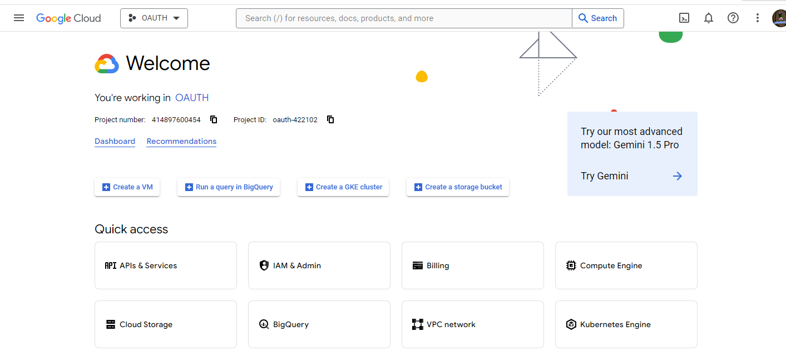   
[ ] pada menu Api Service pili OAUTH Consent Screen
    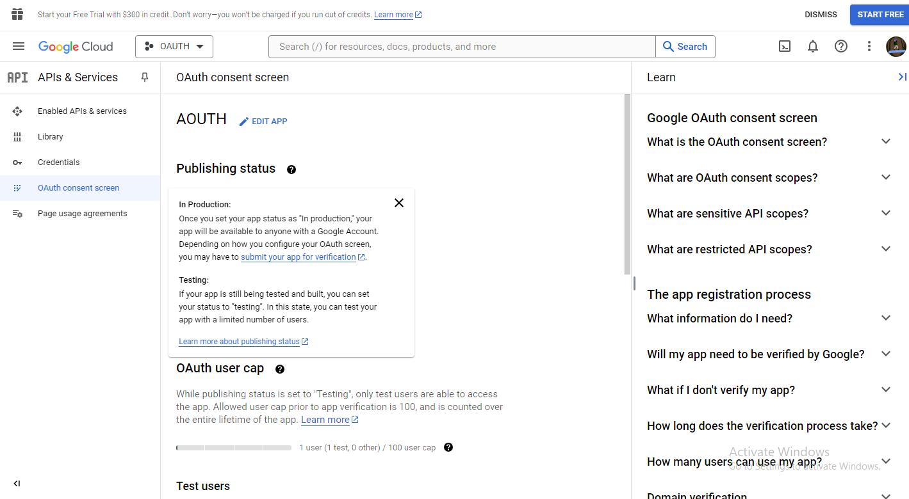  
[ ] jika belum pernah sama sekali maka buat terlebih dahulu kurang lebih yang perlu disi seperti ini kondisinya.
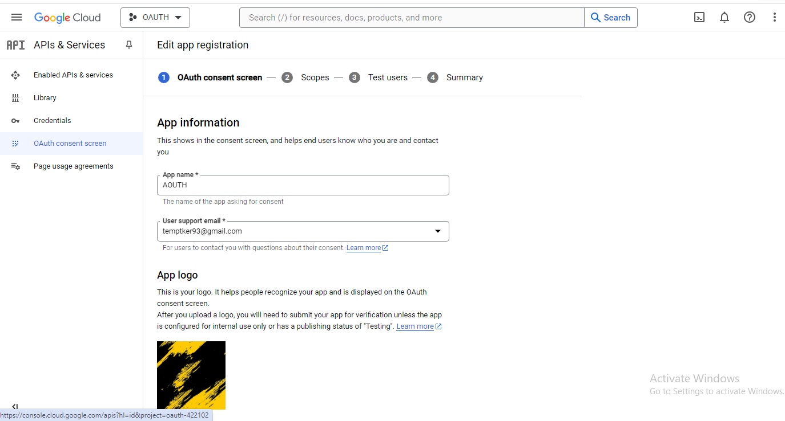 
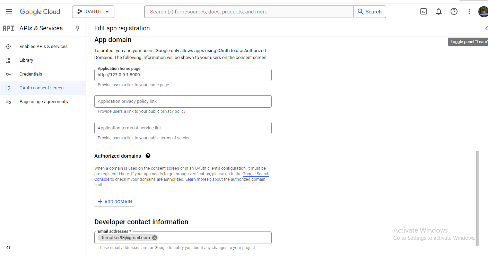 
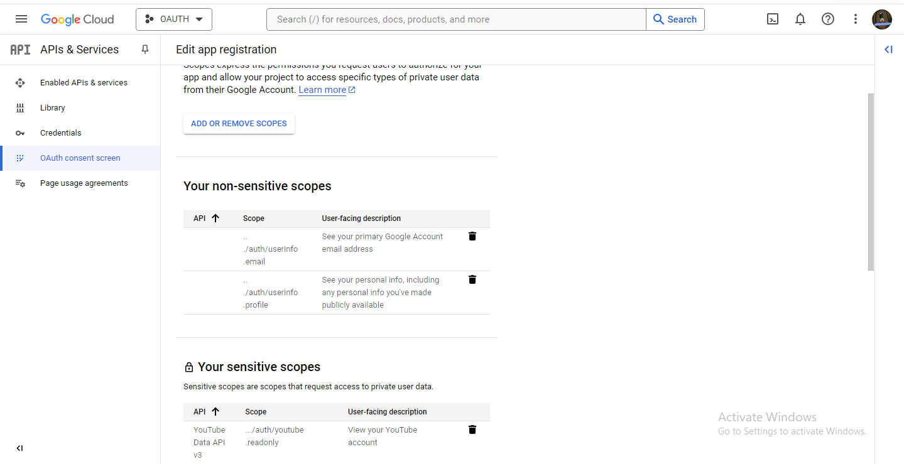  
pada menu add remove scopes diawal tidak ada isinya, dan harus di isi sesui kebutuhan disin saya isi karna casenya ingin insert video melalu aplikasi pribadi. untuk scope yang sendiri bisa dilihat kebutuhan enpoint api yang di butuhkan pada [youtube api v3 docs](https://developers.google.com/youtube/v3/docs)  
[ ] lalu pada tahap test user dipergunakan untuk saat develop akun siapa saja yang boleh akses enpoint tersebut, disin saya hanya memakai akun saya sendiri 
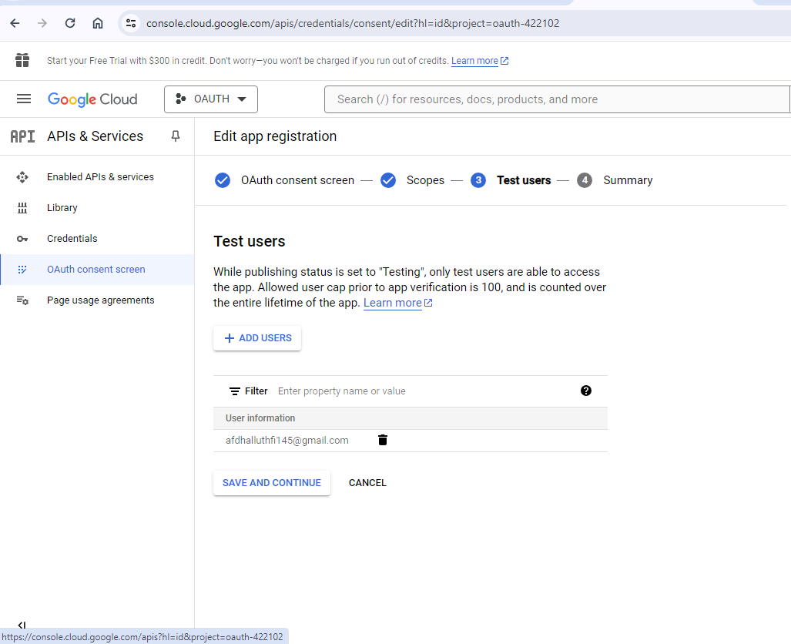  
[ ] dan tahap terakhir adalah summary dari semu step yang sudah di configurasi
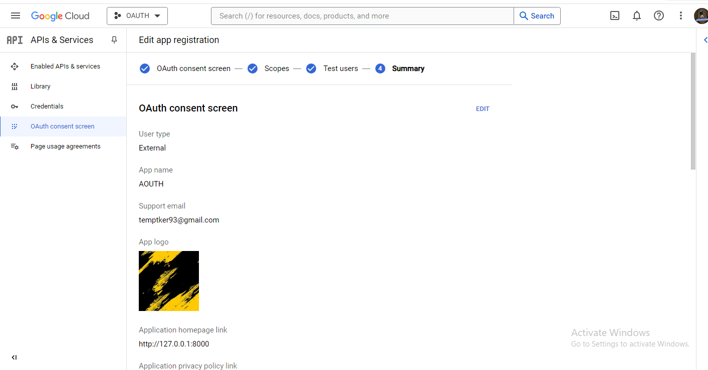  
[ ] setelah membuat OAUTH Consent Screen pindah ke menu Credential,disana kita register Api Key dan OAuth Clien 2.0 Yang Kita gunakan
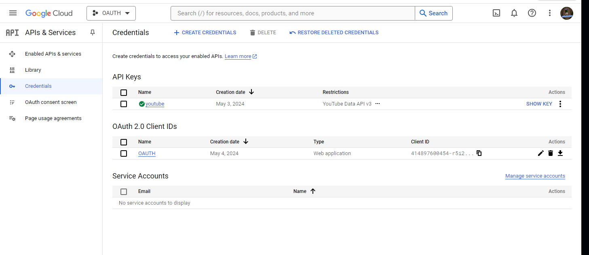
[ ] berikut isi dari register Api Key
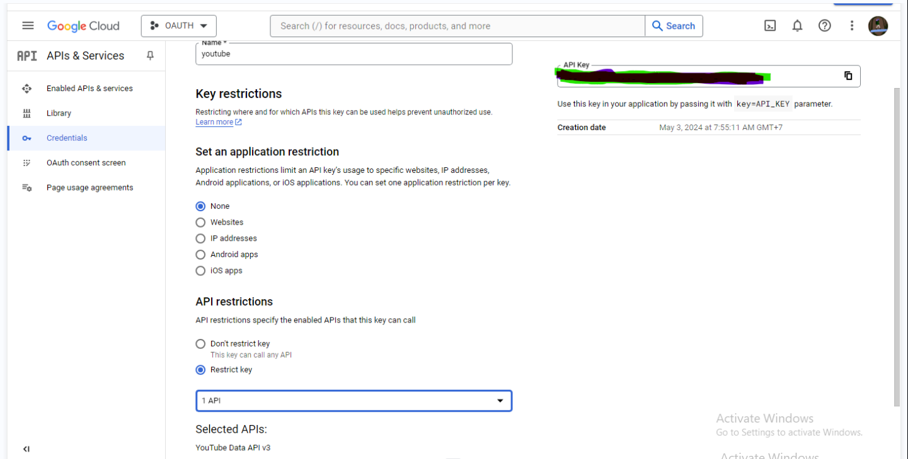 
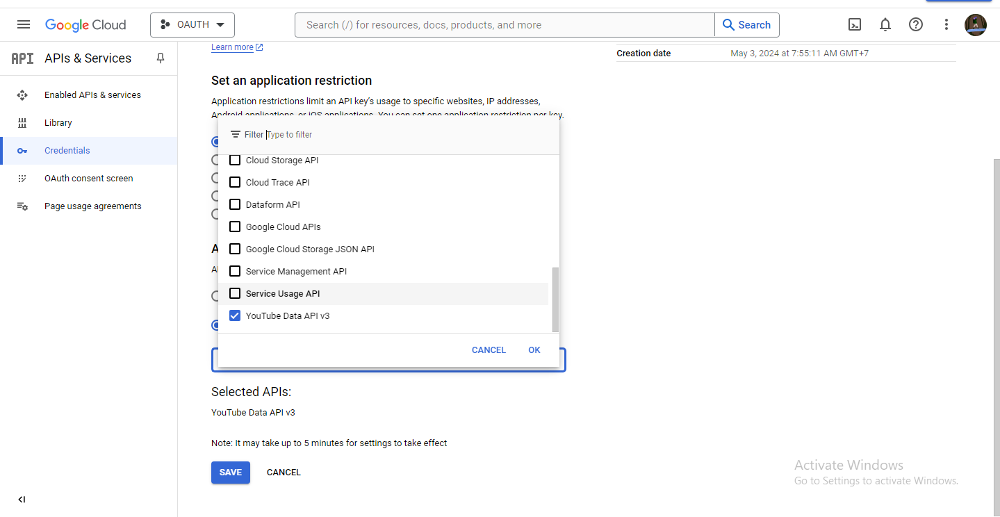 
Isi sesuai dengan data api yang ingin di pakai  
[ ] tahap selanjutnya menyeting  OAuth Consent Screen 2.0 kita menyeting Nama Client dan alamat url back saat melemparparam yang di perlukan.
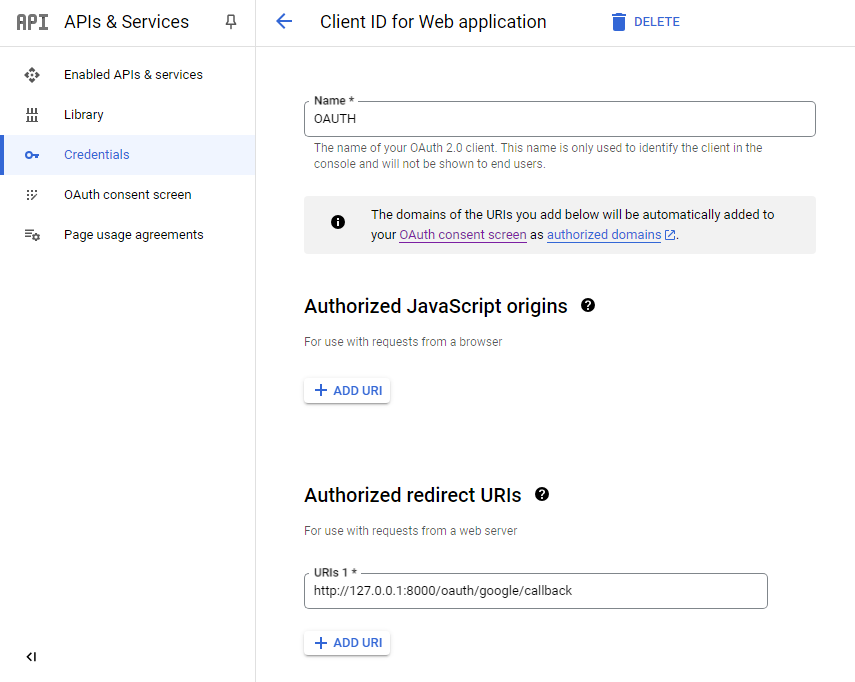